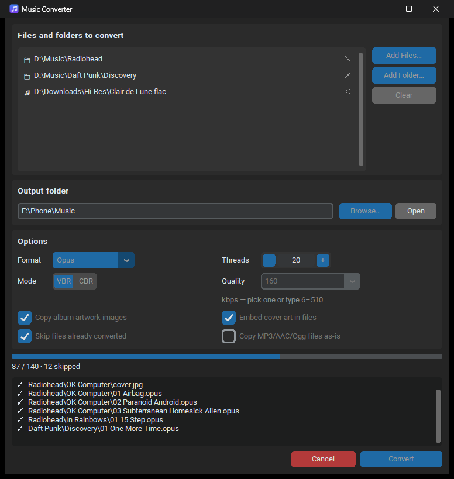

<p align="center">
  
</p>

<h1 align="center">Music Converter</h1>

<p align="center">
  Convert lossless music to phone-friendly formats while keeping your folder structure,
  album artwork and tags intact.
</p>

<p align="center">
  <a href="https://github.com/adurso0747/Music-Converter/actions/workflows/ci.yml"></a>
  <a href="https://github.com/adurso0747/Music-Converter/releases/latest"></a>
  <a href="LICENSE"></a>
  
</p>

<p align="center">
  
</p>

## Features

- **Inputs:** FLAC, WAV, AIFF, WavPack and APE.
- **Outputs:** MP3, Opus, AAC (M4A) and Ogg Vorbis, with VBR/CBR modes and custom bitrates.
- **Files and folders:** add any mix of single files and whole folders.
- **Keeps your folder structure:** selecting `D:\Music\Artist` produces
  `<output>\Artist\<Album>\<Track>.opus`. Single files go straight into the output folder.
- **Album artwork:** cover images (`cover.jpg`, `folder.png`, …) are copied next to the
  converted tracks. Cover art is also embedded in every file, using the track's own
  picture or, if it has none, the folder's cover image. This includes Opus and Ogg.
- **Keeps your tags:** title, artist, album, track number, ReplayGain and so on.
- **Fast:** converts several tracks at once on a configurable number of threads, with a
  progress bar, per-file log and Cancel button.
- **Incremental:** *Skip files already converted* means re-running on your library only
  converts what's new, which is handy for keeping a phone in sync.
- **Mixed libraries:** can copy MP3/AAC/Ogg files found in your folders as-is.
- **Remembers your settings:** output folder, format and quality are kept between runs.
- **Command line:** everything the GUI does is also available from the terminal.

## Download

Grab `MusicConverter-<version>-windows.zip` from the
[latest release](https://github.com/adurso0747/Music-Converter/releases/latest), unzip
it anywhere and run `MusicConverter.exe`. Python and ffmpeg are included.

## Running from source

Requires Python 3.10+ and [ffmpeg](https://ffmpeg.org/) on your `PATH`
(Windows: `winget install ffmpeg`). You can also put `ffmpeg.exe` in the project folder,
or set the `MUSIC_CONVERTER_FFMPEG` environment variable to its full path.

```bash
python -m venv .venv
.venv\Scripts\activate
pip install -e .
```

Then start the GUI with `music-converter`, run `python -m music_converter`, or
double-click `run.pyw` (which uses the project's `.venv` automatically).

### Command line

```bash
music-converter-cli "D:\Music\Artist" "D:\Downloads\song.flac" -o "E:\Phone Music" -f opus -q 160 -j 8
```

Run `music-converter-cli --help` for all options (`--mode vbr|cbr`, `--overwrite`,
`--no-artwork`, `--no-embed-cover`, `--copy-lossy`).

### Quality presets

| Format     | Modes     | Default        |
|------------|-----------|----------------|
| MP3        | VBR / CBR | V0 (~245 kbps) |
| Opus       | VBR / CBR | 128 kbps VBR   |
| AAC (M4A)  | CBR       | 256 kbps       |
| Ogg Vorbis | VBR       | q6 (~192 kbps) |

Bitrate modes accept a custom value: type any number into the Quality box.

## Development

```bash
pip install -e ".[dev]"
pytest              # end-to-end tests run real ffmpeg; skipped if it isn't installed
ruff check .        # lint
ruff format .       # format
```

CI runs lint and tests on Windows and Linux for every push and pull request.

### Building the Windows app

```bash
pip install -e ".[build]"
python scripts/build_exe.py
```

This writes `dist/MusicConverter/` and a shareable zip, bundling the ffmpeg found on your
`PATH` (use `--ffmpeg PATH` to choose one, or `--no-ffmpeg` to leave it out). Pushing a
tag such as `v1.0.1` builds the app on GitHub Actions and attaches it to a release.

### Project layout

```
src/music_converter/
    formats.py    output formats and ffmpeg quality arguments
    planner.py    turns selected files/folders into convert & copy jobs
    converter.py  runs jobs on a thread pool (ffmpeg, cover art, cancel)
    settings.py   remembers user settings between runs
    cli.py        command-line interface
    gui/          customtkinter desktop app
    assets/       app icon
scripts/          build tooling
tests/            pytest suite
```

## License

Music Converter is released under the [MIT License](LICENSE).

The Windows download bundles [FFmpeg](https://ffmpeg.org/), which is licensed separately
under the GPL. Its license and source links are in the `ffmpeg` folder of the download.
